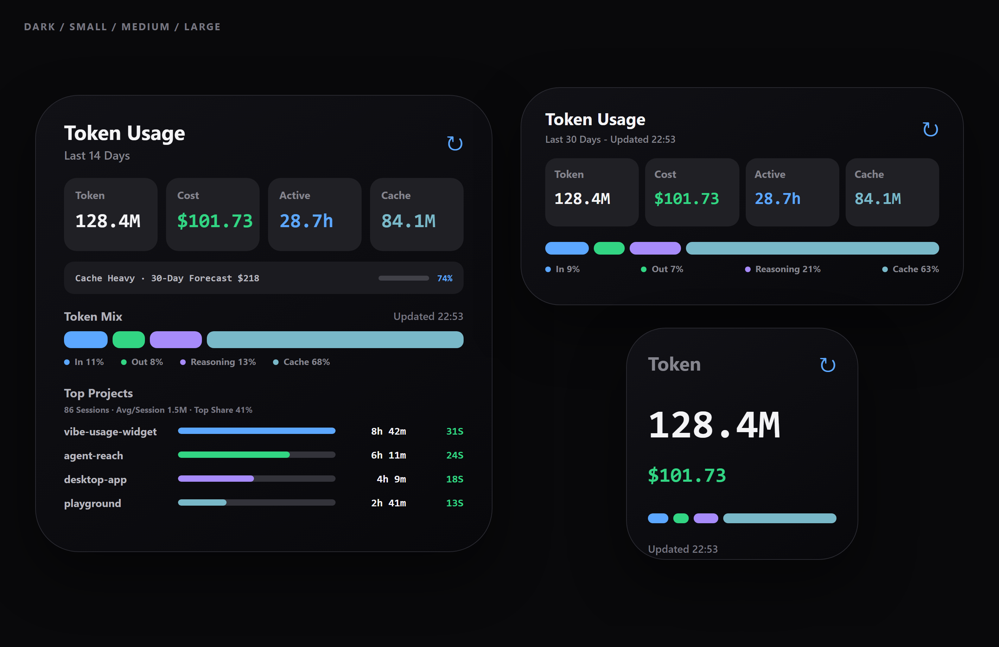
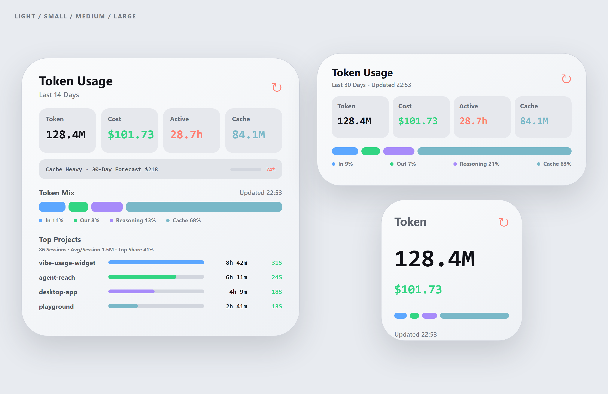
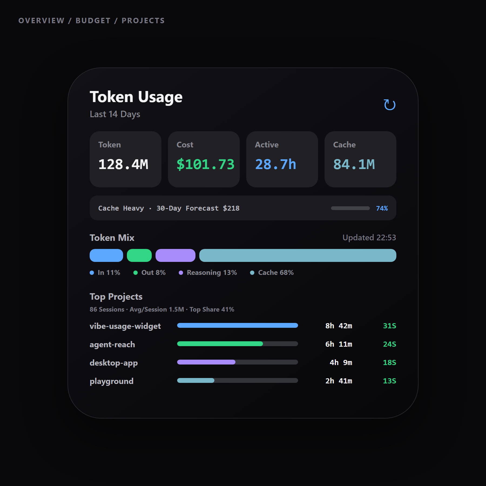
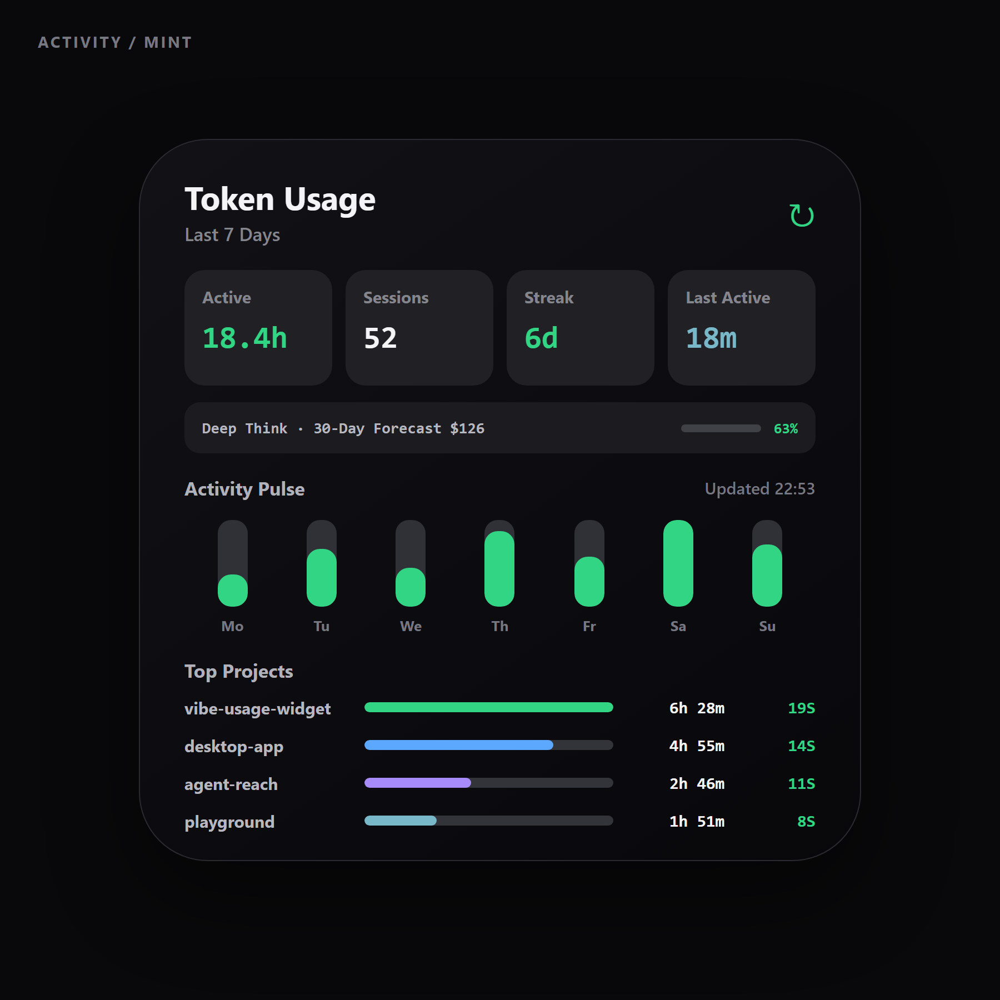
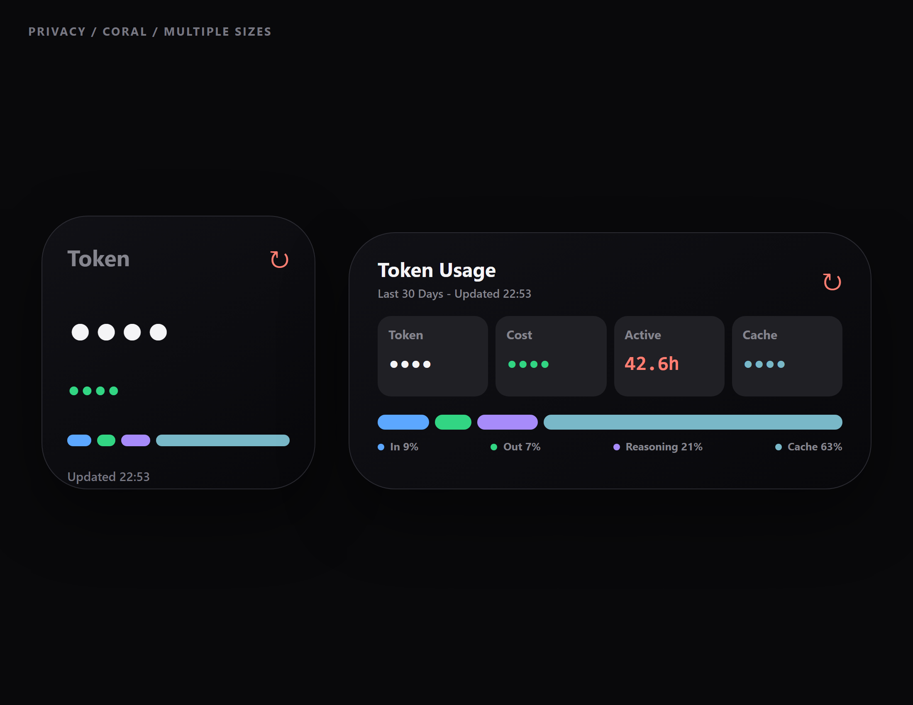

# Vibe Usage iPhone 桌面小组件

当前版本：`0.2.1`

这是一个用于在 iPhone 桌面或负一屏查看 Vibe Usage 数据的 Scriptable 小组件。它不解析手机本地日志，也不上传任何用量数据，只使用你的 `vbu_...` API Key 读取 Vibe Usage 的只读接口：

```text
GET https://vibecafe.ai/api/usage?days=7
```

数据同步仍由官方 `@vibe-cafe/vibe-usage` CLI 或 Vibe Usage 桌面 app 完成；这个仓库只负责 iPhone 小组件展示、缓存、设置和脚本自更新。

## 主要功能

- 支持小号、中号、大号 Scriptable 小组件
- 展示 Token 总量、预估费用、活跃时长和缓存占比
- 展示输入、输出、推理、缓存 Token 组成
- 大号小组件展示 Top Agent 客户端或 Top 模型，并显示 Token 与预估费用
- 中号和大号支持点击刷新图标手动拉取最新数据
- 网络失败时自动回退到本地缓存，并标记离线状态
- 支持中文、英文、跟随系统语言
- 支持浅色、深色、跟随系统外观
- 支持在设置里更换 API Key、调整统计天数、切换大号列表排序
- 支持大号概览/活跃视图、项目排行和最近 7 天活跃脉冲
- 支持月度预算预测、隐私模式和四种强调色
- 支持通过 Widget Parameter 为每个桌面小组件设置独立预设
- 首次使用时选择自动更新或手动检查更新
- 更新前自动备份脚本，并可从设置页恢复最近备份

## 展示

小号、中号和大号，深色模式：



小号、中号和大号，浅色模式：



大号概览、预算预测和项目排行：



大号活跃视图和最近 7 天活跃脉冲：



隐私模式下的小号和中号：



## 文件说明

- `vibe-usage-widget.js`：复制到 Scriptable 的小组件脚本
- `tests/widget-logic.test.js`：格式化、配置解析、缓存匹配和汇总逻辑的 smoke tests
- `docs/`：iPhone 实机截图

## 使用前准备

Vibe Usage 的数据来自电脑端同步。请先在 macOS、Windows 或 Linux 上完成官方同步：

```bash
npx @vibe-cafe/vibe-usage
```

按提示登录并授权后，建议开启后台同步：

```bash
npx @vibe-cafe/vibe-usage daemon install
```

如果你已经配置过，只需要手动同步一次：

```bash
npx @vibe-cafe/vibe-usage sync
```

## 获取 API Key

打开 [Vibe Usage 设置页](https://vibecafe.ai/usage/setup)，生成或复制 `vbu_` 开头的 API Key。

也可以从电脑上的配置文件里查看：

```bash
cat ~/.vibe-usage/config.json
```

其中的 `apiKey` 就是小组件需要的 Key。

## 安装到 iPhone

1. 在 iPhone 安装 [Scriptable](https://scriptable.app/)。
2. 下载或打开本仓库的 `vibe-usage-widget.js`。
3. 在 Scriptable 新建脚本，把 `vibe-usage-widget.js` 的全部内容粘贴进去。
4. 把 `vbu_...` API Key 复制到 iPhone 剪贴板。
5. 在 Scriptable 里手动运行一次脚本。
6. 脚本会读取剪贴板里的 Key，保存到 Scriptable Keychain。
7. 首次配置完成后，按提示选择脚本更新方式：自动更新或手动检查。
8. 回到桌面长按空白处，添加 Scriptable 小组件，并选择这个脚本。

可选：如果不想通过剪贴板导入 Key，可以把下面内容保存为 `vibeusage-widget.json`，放到 Scriptable 的 iCloud 文件夹，然后手动运行一次脚本：

```json
{
  "apiKey": "vbu_xxxxxxxxxxxx",
  "apiUrl": "https://vibecafe.ai",
  "days": 7,
  "language": "auto",
  "theme": "auto",
  "accent": "blue",
  "privacyMode": false,
  "largeView": "overview",
  "topList": "source",
  "topSort": "tokens",
  "monthlyBudget": 0,
  "updateMode": "manual"
}
```

导入成功后，`vibeusage-widget.json` 会被脚本自动删除，避免旧配置反复覆盖 Keychain。

## 小组件内容

小号小组件适合快速看总量、费用、活跃时长和更新时间。

中号小组件展示更完整的概览：Token 总量、费用、活跃时长、缓存、Token 组成和组成百分比。

大号小组件在概览之外还会展示：

- 缓存占比、日均费用、Token 速率
- 当前用量特征，例如缓存主导、深度推理、输出偏高或均衡
- Top Agent 客户端、Top 模型或 Top 项目
- 排行条目显示对应的 Token/费用或活跃时长/会话数

大号切换为“活跃”视图后，会展示活跃时长、会话数、连续活跃天数、最近活跃时间、最近 7 天活跃脉冲和项目排行。项目数据来自接口返回的会话记录；没有项目名时会回退到来源排行。

当所选统计窗口没有用量时，小组件会显示空状态提示。把天数设为 `1` 可以查看今天；可设置范围为 `1` 到 `90` 天。

## 设置入口

在 Scriptable 里直接运行脚本，或点击中号/大号小组件主体，会进入设置页。

设置页包含这些入口：

- 预览：选择小号、中号或大号并使用当前配置预览
- 数据设置：更换 API Key、调整统计天数、设置月度预算、清除缓存
- 显示设置：切换语言、外观、强调色、隐私模式、大号视图、列表类型和排序方式
- 更新设置：检查更新、切换自动/手动更新、恢复脚本备份
- 诊断信息：查看版本、脚本名、API URL、缓存状态、上次检查更新时间等

大号列表类型有三种：

- Agent 客户端：按 Codex、Claude、Cursor、Gemini 等客户端来源统计
- 模型：按模型名统计
- 项目：按会话里的项目名统计

Agent 客户端和模型可以按 Token 或预估费用排序；项目可以按活跃时长或会话数排序。

隐私模式会隐藏精确 Token、费用和项目名，保留组成比例、排行条、活跃时长和预算进度。月度预算显示的是根据当前统计窗口日均费用推算的 30 天预测，不是自然月账单值；预算设为 `0` 即关闭。

## 独立小组件预设

在 iOS 编辑 Scriptable 小组件时，可以在 Parameter 中填写逗号分隔的预设，让每个桌面实例覆盖全局默认设置：

```text
days=1,list=model,sort=cost,view=overview,theme=dark,accent=mint,privacy=off,budget=30
```

支持的参数：

- `days=1..90`
- `list=source|model|project`
- `sort=tokens|cost|active|sessions`
- `view=overview|activity`
- `theme=auto|light|dark`
- `accent=blue|graphite|mint|coral`
- `privacy=on|off`
- `budget=金额`

参数只覆盖当前小组件，不会写回全局设置。点击该小组件的刷新图标时，参数会跟随刷新请求继续生效。

## 刷新机制

脚本会向 iOS 请求大约每 5 分钟刷新一次：

```js
widget.refreshAfterDate = new Date(Date.now() + 5 * 60 * 1000)
```

实际刷新频率由 iOS 和 Scriptable 调度决定，可能会因为省电、网络、系统负载或桌面活跃度被合并或延后。

中号和大号小组件右上角有刷新图标。点击后会通过 Scriptable URL scheme 打开并运行当前脚本，完成一次手动拉取并更新缓存。小号小组件受 iOS/Scriptable 点击区域限制，可能只能保留一个点击目标。

## 脚本更新

首次配置时会出现 OOBE 提示，让你选择更新方式：

- 自动更新：脚本运行时最多每 24 小时检查一次 GitHub Release。发现新版后，会先备份当前脚本，再安装通过校验的新版本。
- 手动检查：不会自动拉取新版，只在设置页点击“检查更新”时检查，并在确认后安装。

自动更新只会覆盖 Scriptable 脚本文件本身，不会修改你的 API Key。API Key 始终保存在 iPhone 的 Scriptable Keychain。

每次安装新版前，脚本会把当前脚本备份为类似下面的文件：

```text
脚本名.backup-v0.2.1-20260712-1810.js
```

如果新版本不符合预期，可以进入“更新设置”里的“恢复备份”恢复最近的脚本备份。恢复也会先备份当前脚本，方便继续回退。

如果自动更新没有生效：

- 确认设置页的“脚本更新”是自动更新。
- 打开诊断信息，确认脚本可写、备份数量正常。
- 确认 GitHub Release 里存在名为 `vibe-usage-widget.js` 的资源。
- 如果 Scriptable 文件在 iCloud，先打开 Scriptable 确认脚本已下载到本机。

## 缓存与离线

每次成功拉取数据后，脚本会把结果缓存到 Scriptable 本地文件：

```text
vibeusage-widget-cache.json
```

缓存文件最多保留 8 组不同 API Key、API URL 和统计天数组合，多个桌面小组件不会再互相覆盖离线缓存。

当网络失败、接口临时不可用或 GitHub 检查更新失败时，小组件会优先展示与当前 API Key、API URL、统计天数匹配的缓存数据，并显示离线提示。

## 安全边界

- API Key 只保存在 iPhone 的 Scriptable Keychain。
- 小组件只请求只读接口：`GET /api/usage?days=...`。
- 小组件不会读取电脑本地日志。
- 小组件不会上传你的本地数据。
- 真实的数据同步仍由官方 CLI 或桌面 app 完成。
- 脚本自更新只从本仓库 GitHub Release 下载名为 `vibe-usage-widget.js` 的资源，并会做基础校验。

## 常见问题

### 小组件不刷新？

iOS 小组件刷新不是严格定时器。可以先点击中号或大号右上角刷新图标手动刷新；如果仍然没有数据，请在电脑上运行：

```bash
npx @vibe-cafe/vibe-usage sync
```

### 显示需要 API Key？

把 `vbu_...` Key 复制到 iPhone 剪贴板，然后在 Scriptable 里手动运行一次脚本。也可以用 `vibeusage-widget.json` 导入。

### 设置天数为 1 没有数据？

`days: 1` 表示今天这个窗口。如果今天没有用量，小组件会显示“今天暂无用量”。可以在数据设置里把天数调大，例如 `7` 或 `30`。

### 更换 API Key 后旧数据还在？

脚本会按 API Key、API URL 和统计天数匹配缓存。更换 Key 后刷新一次即可拉取新账号的数据；如果网络失败且没有匹配缓存，会显示错误或空状态。

## 开发

本仓库保持一个可直接复制到 Scriptable 的单文件脚本。修改核心逻辑后建议运行：

```bash
node --check vibe-usage-widget.js
node tests/widget-logic.test.js
git diff --check
```

测试覆盖配置解析、版本比较、更新判断、格式化、用量汇总、缓存匹配和空状态文案等基础逻辑。
