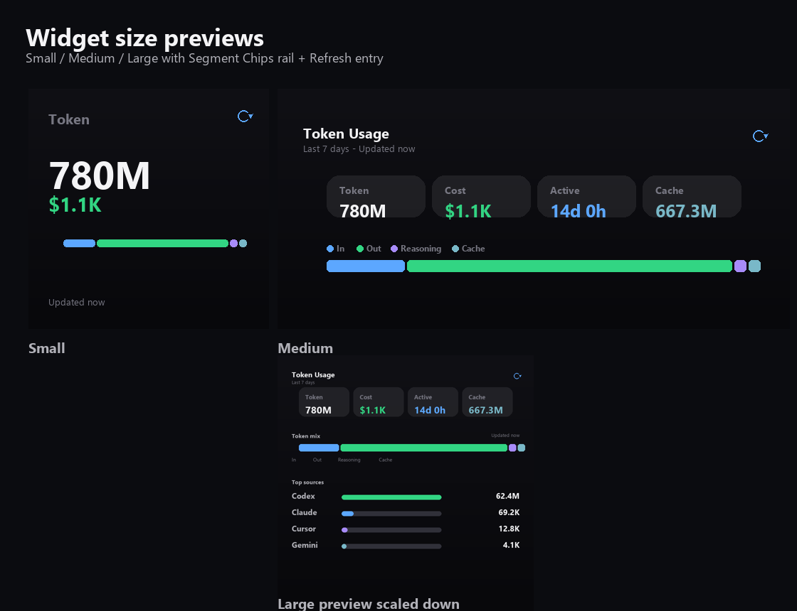

# Vibe Usage iPhone 桌面小组件

基于 `wgjuan2314/shuangzi-xubei` 的 Scriptable 小组件思路，改成显示你的 Vibe Usage 数据。它运行在 iPhone 桌面/负一屏，不解析 Mac 本地日志，也不上传数据，只用 `vbu_...` API Key 读取 `https://vibecafe.ai/api/usage?days=7`。

## 文件

- `vibe-usage-widget.js`: 复制到 Scriptable 的小组件脚本
- `widget-size-previews.png`: 小号、中号、大号预览



## 先在 Mac 上同步数据

Vibe Usage 的数据来自电脑本地日志，所以需要先在 Mac 上完成官方同步：

```bash
npx @vibe-cafe/vibe-usage
```

按提示登录并授权后，建议开启后台同步：

```bash
npx @vibe-cafe/vibe-usage daemon install
```

如果你已经配置过，只需要：

```bash
npx @vibe-cafe/vibe-usage sync
```

## 获取 API Key

打开 [Vibe Usage 设置页](https://vibecafe.ai/usage/setup)，生成或复制 `vbu_` 开头的 API Key。

也可以从 Mac 的配置文件里取：

```bash
cat ~/.vibe-usage/config.json
```

其中的 `apiKey` 就是小组件需要的 Key。

## 导入到 iPhone

1. iPhone 安装 Scriptable。
2. 在 Scriptable 新建脚本，把 `vibe-usage-widget.js` 全部内容粘进去。
3. 把 `vbu_...` API Key 复制到 iPhone 剪贴板。
4. 在 Scriptable 里手动运行一次脚本，它会把 Key 写入 iPhone Keychain。
5. 长按桌面添加 Scriptable 中号小组件，选择这个脚本。

可选：如果剪贴板不方便，把下面内容保存为 `vibeusage-widget.json`，放到 Scriptable 的 iCloud 文件夹，再运行一次脚本：

```json
{
  "apiKey": "vbu_xxxxxxxxxxxx",
  "apiUrl": "https://vibecafe.ai",
  "days": 7
}
```

导入成功后文件会被脚本自动删除，避免旧 Key 反复覆盖。

## 显示内容

- 近 7 天 Token 总量
- 预估费用
- 活跃时长
- 输入、输出、推理、缓存 Token 组成条
- 按工具统计的 Top 来源

小组件会请求大约每 5 分钟刷新一次。iOS 会按系统策略调度，实际刷新可能被合并或延后。网络失败时会显示上次缓存并标记离线。

中号和大号小组件右上角有刷新图标；点它会通过 Scriptable URL scheme 打开并运行当前脚本，完成一次手动拉取并更新缓存。点击小组件主体会打开脚本设置。小号组件受 iOS/Scriptable 点击区域限制，可能只能保留一个点击目标。

## 安全边界

- API Key 只存在 iPhone 的 Scriptable Keychain。
- 小组件只发起只读请求：`GET /api/usage?days=7`。
- 真正的数据上传仍由官方 `@vibe-cafe/vibe-usage` CLI 或 Vibe Usage Mac app 完成。
